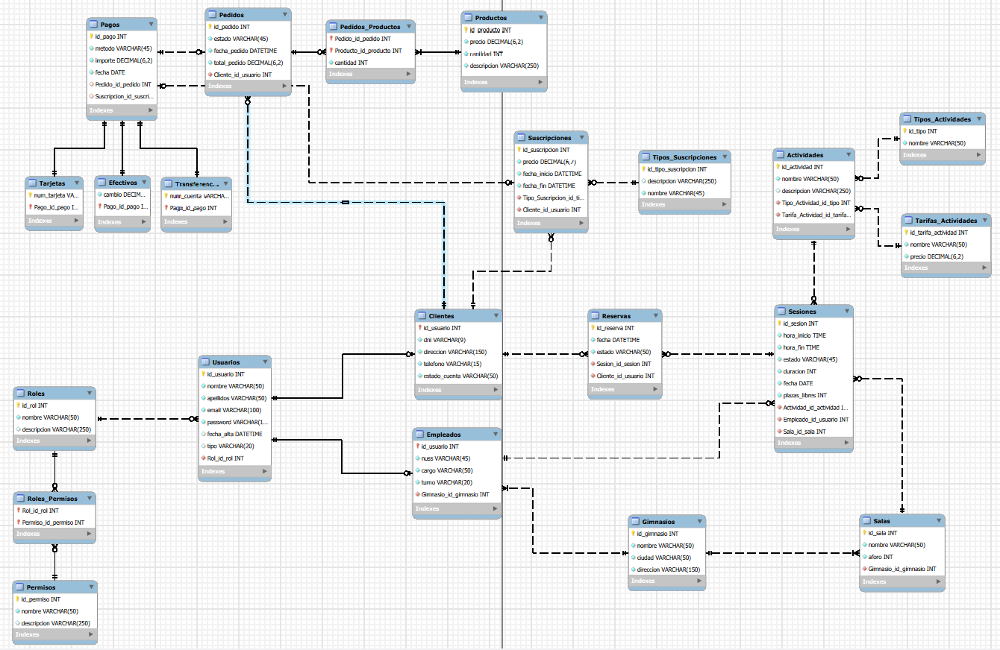

# 🏋️ GymFit Center - Gestión de Gimnasio

Proyecto Intermodular de Desarrollo de Aplicaciones Multiplataforma. Actualmente en **Fase 1: Diseño y Modelado de Datos**.

## 📊 Modelo Relacional
Aquí puedes ver la arquitectura de tablas y sus relaciones:

 

## 📈 Estado del Proyecto
- [x] Análisis de requisitos.
- [x] Diseño del Modelo Relacional (Arquitectura de Tablas).
- [x] Script de creación de Base de Datos (MySQL).
- [ ] Implementación de lógica de negocio (Java).
- [ ] Interfaz de usuario.

## 🗄️ Arquitectura de Persistencia
La base de datos se ha diseñado siguiendo el modelo relacional, garantizando la integridad referencial y la escalabilidad del sistema.

### Entidades Principales:
* **Gestión de Usuarios:** Sistema de herencia entre Usuarios, Socios y Monitores.
* **Control de Acceso:** Implementación de Roles y Permisos (RBAC).
* **Operativa:** Gestión de Actividades, Instalaciones, Horarios y Reservas.
* **Comercial:** Sistema de Ofertas, Contratos y Promociones.

## 📁 Contenido del Repositorio
* **`gymfit_db.sql`**: Script SQL con la creación de tablas e inserción de datos de prueba (en la carpeta /database).
* **`modelo_relacional.mwb`**: Archivo fuente de MySQL Workbench para edición del modelo (en la carpeta /design).
* **`nodelo_relacional.png`**: Exportación visual del modelo para consulta rápida (en la carpeta /design).

---
*Este proyecto forma parte de mi formación en el ciclo de DAM.*
